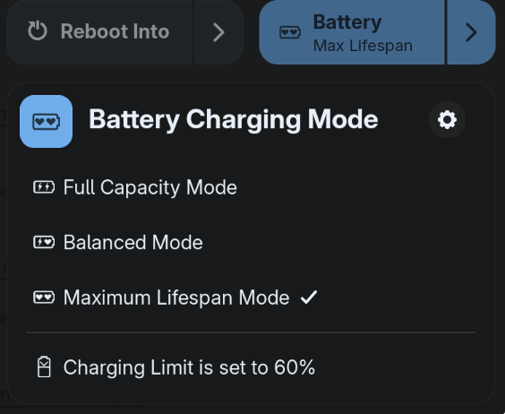
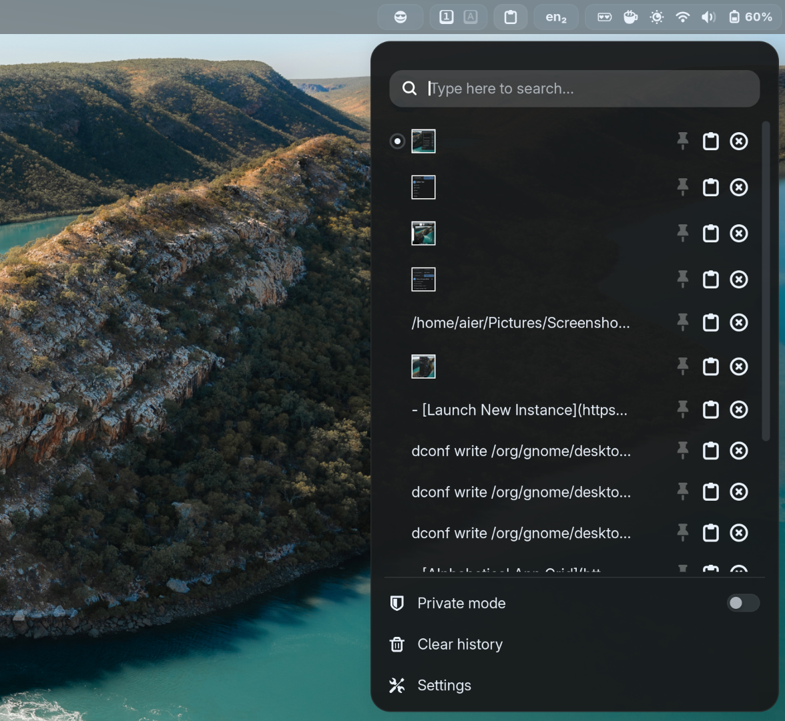
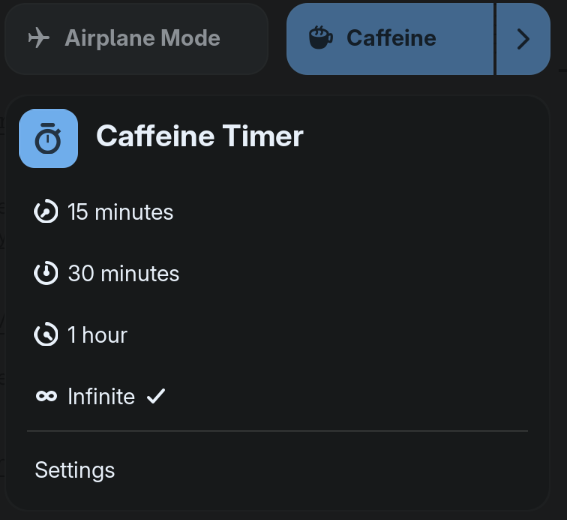
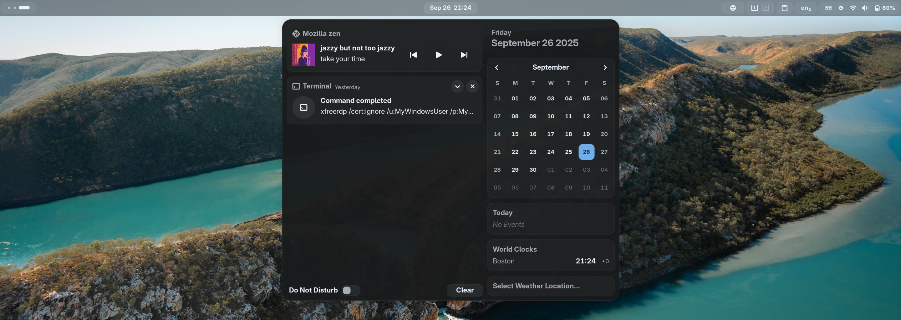
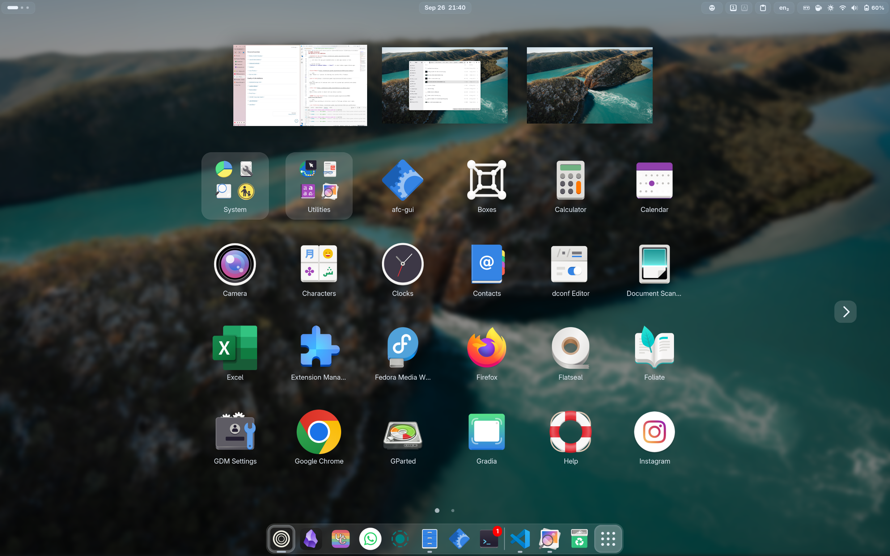
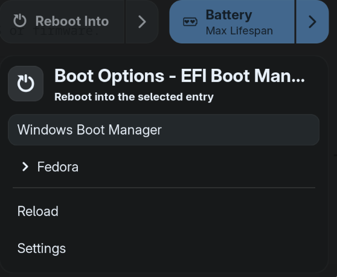
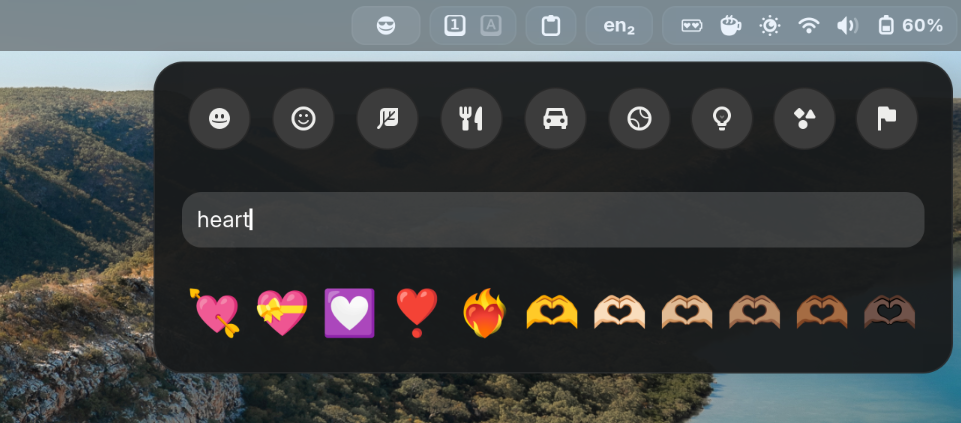
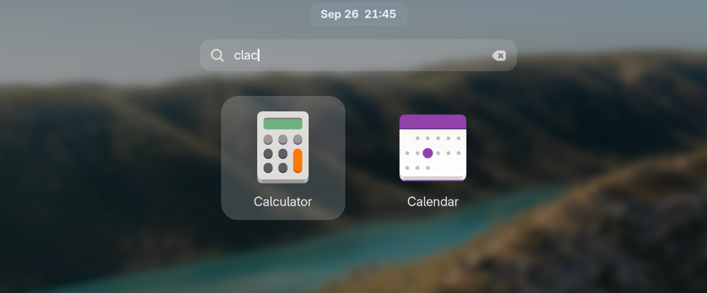
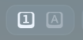

::::card-grid

:::card title="Author" icon="fluent-emoji:writing-hand"
aier
:::

<!-- :::card title="Co-author(s)" icon="fluent-emoji:two-hearts"
::: -->

::::

:::tip You might want to go through with setting up Gnome through [Gnome Guide](../notes/linux-guides/gnome.md) first...
or just proceed! :\)
:::

:::note Just a heads up, this guide is not going to be as polished as the ones released in the main series as I am in college (my career is 100% unrelated to CS). I apologize ahead of times and thank you for reading! 
:::

## Let's Add Some More Keyboard Shortcuts! 

:::tip The keyboard shortcuts in the Gnome Guide are quite minimal. I personally have these shortcuts as well: 

`<Super><Shift>Return` --> Center Window on the screen. 

`<Super>F` --> Toggle full screen (even when `f11` doesn't work, unless the app doesn't support full screen mode, this shortcut will work). 

`<Super>X` --> Close window (very ergonomic). 
:::

```bash
# <Super> + <Shift> + Return → Center window
gsettings set org.gnome.desktop.wm.keybindings move-to-center "['<Super><Shift>Return']"

# <Super> + F → Toggle fullscreen
gsettings set org.gnome.desktop.wm.keybindings toggle-fullscreen "['<Super>F']"

# <Super> + X → Close window
gsettings set org.gnome.desktop.wm.keybindings close "['<Super>X', '<Alt>F4']"
```


## Facial Recognition with Howdy 

:::tip This applies outside of Gnome as well. If your computer supports facial recognition, you can check the details to setting up Howdy from the [official GitHub page](https://github.com/boltgolt/howdy?tab=readme-ov-file). 
:::

## GNOME Extensions

### Personal Essentials
:::::card

:::: collapse 

- [Battery Health Charging](https://extensions.gnome.org/extension/5724/battery-health-charging/)

  ::: info Lets you set charging thresholds to preserve battery health.
  
  :::

- [Just Perfection](https://extensions.gnome.org/extension/3843/just-perfection/)  

  ::: info Tweaks or hides nearly every GNOME Shell UI element for fine‑grained control.
  
  :::

  :::tip My settings: 

  ==Due to visual inconsistencies and bugs, I do not use the `hide-top-bar` extension, I rather simply hide the top bar and only have it show in the overview through `just-perfection`. 
  
  ```bash
  # Hide top bar and only show in overview
  dconf write /org/gnome/shell/extensions/just-perfection/panel false
  dconf write /org/gnome/shell/extensions/just-perfection/panel-in-overview true

  
  # Hide ripple box in hot corner
  dconf write /org/gnome/shell/extensions/just-perfection/ripple-box false
  
  # Hide searchbar in overview (you can still search 
  # by just typing)
  dconf write /org/gnome/shell/extensions/just-perfection/search false
  
  # Hide window titles when hovering over windows in 
  # overview
  dconf write /org/gnome/shell/extensions/just-perfection/window-preview-caption false
  
  # Always show workspace switchers no matter how many 
  # workspaces are opened (especially useful for dynamic 
  # workspace users)
  dconf write /org/gnome/shell/extensions/just-perfection/workspace-switcher-should-show true
  
  # Make workspace switchers larger
  dconf write /org/gnome/shell/extensions/just-perfection/workspace-switcher-size 13
  ```
  :::

- [Launch New Instance](https://extensions.gnome.org/extension/600/launch-new-instance/)  

  ::: info
  Always opens a new app instance from the dash or app grid.
  :::

- [Clipboard Indicator](https://extensions.gnome.org/extension/779/clipboard-indicator/)  

  ::: info Provides a clipboard history and quick paste menu in the top panel.
  
  :::
  
- [Caffeine](https://extensions.gnome.org/extension/517/caffeine/)  

  ::: info Prevents screen dimming and suspension on demand.
  
  :::

- [User Themes](https://extensions.gnome.org/extension/19/user-themes/)  

  ::: info Allows loading and applying custom GNOME Shell themes from your home directory.

  
  :::

- [Blur my Shell](https://extensions.gnome.org/extension/3193/blur-my-shell/)  

  ::: info Adds customizable blur effects to GNOME Shell elements for a polished look.
  
  :::

::::
:::::

### Quality of Life Additions
:::::card

::::collapse

- [Alphabetical App Grid](https://extensions.gnome.org/extension/4269/alphabetical-app-grid/)  

  ::: info Sorts the app grid alphabetically to make apps easier to find.
  
  :::

  :::tip My settings:
  **Position of ordered folders --> Start**, to make folders appear before apps. 
  :::


- [Custom Reboot](https://extensions.gnome.org/extension/5542/custom-reboot/)  

  ::: info Adds “Reboot to…” options for booting into another OS or firmware.
  
  :::

- [Dash to Dock](https://extensions.gnome.org/extension/307/dash-to-dock/)  

  ::: info Moves the dash out of overview into a dock for quicker app launching and window switching.
  
  :::

  :::tip My settings: 
  Go to the extension's settings --> Appearances, turn on `Shrink the dash` to make the dash smaller and slicker. 
  :::


- [Emoji Copy](https://extensions.gnome.org/extension/6242/emoji-copy/)  

  ::: info Adds an emoji picker to search and copy emojis quickly.
  
  :::

- [GNOME Fuzzy App Search](https://extensions.gnome.org/extension/3956/gnome-fuzzy-app-search/)  

  ::: info Enables fuzzy matching in Activities search to find apps without exact names.
  
  :::

- [Lock Keys](https://extensions.gnome.org/extension/36/lock-keys/)  

  ::: info Shows Caps Lock and Num Lock status in the top panel.
  
  :::

::::
:::::