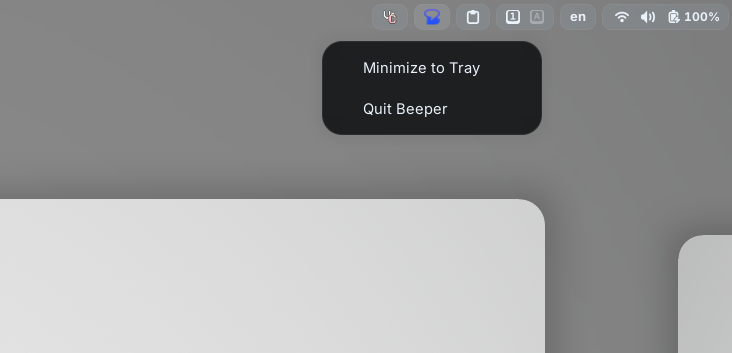
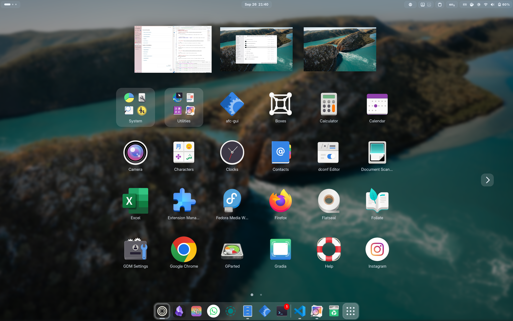

:::tip You might want to go through with setting up Gnome through [Gnome Guide](/linux-guides/gnome/) first.
:::

:::important This guide is not going to be as detailed as the ones released in the main series as its content updates much more often as newer versions of Gnome and new extensions come out.
:::

## Facial recognition with Howdy

:::tip This applies outside of Gnome as well. If your computer supports facial recognition, you can check the details to setting up Howdy from the [official GitHub page](https://github.com/boltgolt/howdy?tab=readme-ov-file).
:::

## Better-looking Fonts

:::tip The Adwaita series font is pretty good, but I find the IBM Plex series to be more modern and pleasing.
:::

:::tabs

@tab ::devicon:fedora:: Fedora

```bash
sudo dnf install ibm-plex-fonts-all
```

@tab ::devicon:archlinux:: Arch

```bash
sudo pacman -S ttf-ibm-plex
```

@tab ::devicon:debian:: Debian/Ubuntu

```bash
sudo apt install fonts-ibm-plex
```

:::

```bash
dconf write /org/gnome/desktop/interface/font-name "'IBM Plex Sans 11'"
dconf write /org/gnome/desktop/interface/document-font-name "'IBM Plex Sans 12'"
dconf write /org/gnome/desktop/interface/monospace-font-name "'IBM Plex Mono 11'"
```

<!-- dconf reset /org/gnome/desktop/interface/font-name  -->
<!-- dconf reset /org/gnome/desktop/interface/document-font-name  -->
<!-- dconf reset /org/gnome/desktop/interface/monospace-font-name  -->

## GNOME Extensions

### Personal Essentials

:::::card

:::: collapse

- [`AppIndicator and KStatusNotifierItem Support`](https://extensions.gnome.org/extension/615/appindicator-support/)

  ::::card

  :::info Adds AppIndicator, KStatusNotifierItem and legacy Tray icons support to the Shell.
  :::

  

  ::::

- [Battery Health Charging](https://extensions.gnome.org/extension/5724/battery-health-charging/)

  ::: info Lets you set charging thresholds to preserve battery health.
  
  :::

- [Caffeine](https://extensions.gnome.org/extension/517/caffeine/)

  ::: info Prevents screen dimming and suspension on demand.
  
  :::

- [Clipboard Indicator](https://extensions.gnome.org/extension/779/clipboard-indicator/)

  ::: info Provides a clipboard history and quick paste menu in the top panel.
  
  :::

  ::: tip Windows-like `<Super>v` keyboard shortcut

  ```bash
  dconf write /org/gnome/shell/keybindings/toggle-message-tray "['<Super>M']"
  dconf write /org/gnome/shell/extensions/clipboard-indicator/toggle-menu "['<Super>V']"
  ```

  :::

- [Dash to Dock](https://extensions.gnome.org/extension/307/dash-to-dock/)

  ::: info Moves the dash out of overview into a dock for quicker app launching and window switching.
  
  :::

  :::tip My settings:
  Go to the extension's settings --> Appearances, turn on `Shrink the dash` to make the dash smaller and slicker.
  :::

- [Just Perfection](https://extensions.gnome.org/extension/3843/just-perfection/)

  ::: info Tweaks or hides nearly every GNOME Shell UI element for fine‑grained control.
  
  :::

  :::tip My settings:

  ```bash
  # Make top bar thinner
  dconf write /org/gnome/shell/extensions/just-perfection/panel-size 28

  # Hide ripple box in hot corner
  dconf write /org/gnome/shell/extensions/just-perfection/ripple-box false

  # Hide searchbar in overview (you can still search
  # by just typing)
  dconf write /org/gnome/shell/extensions/just-perfection/search false

  # Hide window titles when hovering over windows in
  # overview
  dconf write /org/gnome/shell/extensions/just-perfection/window-preview-caption false

  # Always show workspace switchers no matter how many
  # workspaces are opened (especially useful for dynamic
  # workspace users)
  dconf write /org/gnome/shell/extensions/just-perfection/workspace-switcher-should-show true

  # Make workspace switchers larger
  dconf write /org/gnome/shell/extensions/just-perfection/workspace-switcher-size 13
  ```

  :::

- [Kiwi is not Apple](https://extensions.gnome.org/extension/8276/kiwi-is-not-apple/)

  ::: info Offers many UI changes to make Gnome more Mac-like. I use it for the window title, lock key indicator, and transparent window move function.
  :::

  ```bash
  # aier's Kiwi settings

  # Disable (for consistency):
  # This feature stylizes titlebuttons to look
  # like traffic lights. They can be inconsistent.
  dconf write /org/gnome/shell/extensions/kiwi/enable-app-window-buttons "false"
  dconf write /org/gnome/shell/extensions/kiwi/show-window-controls "false"

  # Enable (for aesthetics):
  # Stylize the keyboard layout indicator
  dconf write /org/gnome/shell/extensions/kiwi/keyboard-indicator "true"

  # Enable (for utility):
  # Great utility; allows you to see lock keys
  # status on the top bar. This replaces the lock
  # keys extension that used to be in my setup.
  dconf write /org/gnome/shell/extensions/kiwi/lock-icon "true"

  # Disable (for personal preference):
  # This feature moves the clock to the right and
  # moves notifications to the quick settings.
  # I prefer the original Gnome layout.
  dconf write /org/gnome/shell/extensions/kiwi/move-calendar-right "false"

  # Disable (due to buginess & personal preference)
  # I personally dislike this behavior as I
  # prefer manual window and workspace management.
  dconf write /org/gnome/shell/extensions/kiwi/move-window-to-new-workspace "false"

  # Enable (for aesthetic & utility)
  # This fills up empty space on the left side and
  # you can click on it for additional functionality.
  dconf write /org/gnome/shell/extensions/kiwi/show-window-title "true"

  # Disable (due to buginess & personal preference)
  dconf write /org/gnome/shell/extensions/kiwi/transparent-move "false"
  ```

::::

:::::

### Quality of Life Additions

:::::card

::::collapse

- [Alphabetical App Grid](https://extensions.gnome.org/extension/4269/alphabetical-app-grid/)

  ::: info Sorts the app grid alphabetically to make apps easier to find.
  
  :::

  :::tip My settings:
  **Position of ordered folders --> Start**, to make folders appear before apps.
  :::

- [Custom Reboot](https://extensions.gnome.org/extension/5542/custom-reboot/)

  ::: info Adds “Reboot to…” options for booting into another OS or firmware.
  
  :::

- [Emoji Copy](https://extensions.gnome.org/extension/6242/emoji-copy/)

  ::: info Adds an emoji picker to search and copy emojis quickly.
  
  :::

  :::tip The default `<Super>.` keybinding for Emoji Copy sometimes interferes with the ibus emoji shortcut, I simply remapped it to `<Super><Shift>v`.
  :::

- [GNOME Fuzzy App Search](https://extensions.gnome.org/extension/3956/gnome-fuzzy-app-search/)

  ::: info Enables fuzzy matching in Activities search to find apps without exact names.
  
  :::

- [Auto Power Profile](https://extensions.gnome.org/extension/6583/auto-power-profile/)

  ::: info Changes power profile based on AC status and battery percentage.
  :::

- [Night Theme Switcher](https://extensions.gnome.org/extension/2236/night-theme-switcher/)

  ::: info Switcher between light and dark theme depending on sunrise/sunset.
  :::

::::
:::::

### Previously in My Setup

::::::card
::::: collapse

- [Blur my Shell](https://extensions.gnome.org/extension/3193/blur-my-shell/)

  ::: info
  Always opens a new app instance from the dash or app grid.
  :::

  ::: info Adds customizable blur effects to GNOME Shell elements for a polished look.
  
  :::

  ::: note
  I have replaced Blur My Shell's functionalities with the Kiwi extension.
  :::

- [Launch New Instance](https://extensions.gnome.org/extension/600/launch-new-instance/)

  ::: info
  Always opens a new app instance from the dash or app grid.
  :::

  ::: note
  I no longer use this extension because you can simply do control enter when searching an app to open a new instance. With this said, you'd gain back the default ability to switch to an app through the overview search.
  :::

- [Lock Keys](https://extensions.gnome.org/extension/36/lock-keys/)

  ::: info Shows Caps Lock and Num Lock status in the top panel.
  
  :::

  ::: note Archived because kiwi has this feature built in.
  :::

- [Tinted Shell](https://extensions.gnome.org/extension/8906/tinted-shell/)

  :::info Tints Gnome Shell elements to match with accent color.
  
  :::

- [User Themes](https://extensions.gnome.org/extension/19/user-themes/)

  ::: info Allows loading and applying custom GNOME Shell themes from your home directory.

  
  :::

:::::
::::::
