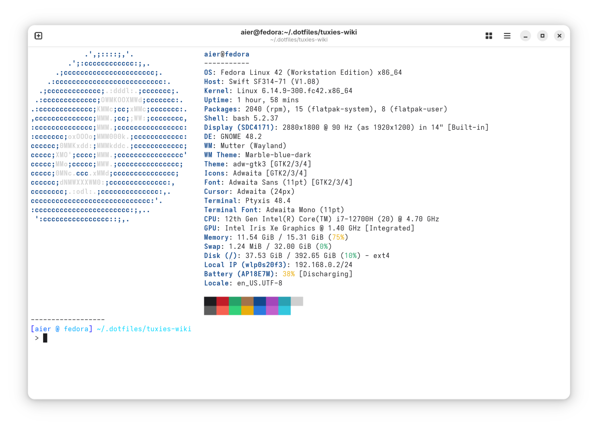

::::card-grid

:::card title="Author(s)" icon="fluent-emoji:writing-hand"
aier
:::

:::card title="Co-author(s)" icon="fluent-emoji:two-hearts"
Lunear
:::

::::

:::info
This guide will walk you through customizing your Bash prompt, how to run `fastfetch` on start in your terminal, and a few useful terminal programs.
:::

:::danger
This tutorial assumes that you are using Bash as your shell, even though some part of the tutorial may apply to non-Bash shells.

**For non-Bash users, we cannot guarantee success and will not take responsibility to damages to your system.**
:::

## Back up current `.bashrc`

Make a copy of your current `.bashrc` file and place it somewhere safe.

```bash
cp ~/.bashrc ~/.bashrc-original # Makes a copy of current .bashrc file named .bashrc-original
```

Make sure that you have a `.bashrc` file in your `/home/$USER/` at all times. If you followed the command above, you'd be fine.

You'll be editing the `.bashrc` file from your home directory in this guide, but if you ever want/need to revert back to the original file, simply replace the content in `.bashrc` from the backup you've made.

:::::details Here is an exemplar `.bashrc` file taken from my Fedora 42 Workstation (hopefully you don't have to use this):

:::code-tabs

@tab .bashrc

```bash
# .bashrc

# Source global definitions
if [ -f /etc/bashrc ]; then
    . /etc/bashrc
fi

# User specific environment
if ! [[ "$PATH" =~ "$HOME/.local/bin:$HOME/bin:" ]]; then
    PATH="$HOME/.local/bin:$HOME/bin:$PATH"
fi
export PATH

# Uncomment the following line if you don't like systemctl's auto-paging feature:
# export SYSTEMD_PAGER=

# User specific aliases and functions
if [ -d ~/.bashrc.d ]; then
    for rc in ~/.bashrc.d/*; do
        if [ -f "$rc" ]; then
            . "$rc"
        fi
    done
fi
unset rc
```

:::

:::::

## Aesthetic changes

:::::details Quick append & preview

Your `.bashrc` should look something like this if you decide to follow all instructions in the following section:

::: code-tabs

@tab .bashrc

```bash
# ... omitted original .bashrc content above

fastfetch

PS1='------------------\n\[$(tput setaf 21)\][\[$(tput setaf 27)\]\u \[$(tput setaf 33)\]@ \[$(tput setaf 39)\]\h\[$(tput setaf 21)\]] \[$(tput setaf 45)\]\w\[$(tput sgr0)\]\n > '
```

:::



:::::

### Autorun `fastfetch` when you open the terminal

You can make your bash terminal autorun `fastfetch` to display system information every time it starts by appending the following at the bottom of your file.

:::::steps

- **Installation**

  :::tabs

  @tab Fedora

  ```bash
  sudo dnf install fastfetch
  ```

  @tab Arch

  ```bash
  pacman -S fastfetch
  ```

  @tab Debian/Ubuntu

  ```bash
  sudo apt install fastfetch
  ```

  :::

- **Set up `fastfetch` in shell**

  You can append the following at the bottom of your `.bashrc`:

  :::code-tabs
  @tab .bashrc

  ```bash
  fastfetch
  ```

  :::

  and here is what it looks like:

  :::demo-wrapper img
  
  :::

- **Changing the look of the prompt (`PS1`)**

  Now, in your `.bashrc`, you change the looks of your prompt looks through modifying the `PS1` variable.

  You can append the following at the bottom of your `.bashrc`:

  :::code-tabs
  @tab .bashrc

  ```bash
  PS1='------------------\n\[$(tput setaf 56)\][$(tput setaf 56)\]\u \[$(tput setaf 92)\]@ \[$(tput setaf 128)\]\h\[$(tput setaf 128)\]] \[$(tput setaf 200)\]\w\[$(tput sgr0)\]\n > '
  ```

  :::

  and here is what it looks like:

  

- **More resources**

  - [`PS1` customization by Rahul from tecadmin.net](https://tecadmin.net/how-to-customize-bash-prompt-ps1-in-linux/)

:::::

## Terminal programs

:::::details Quick append & preview

Your `.bashrc` should look something like this if you decide to follow all instructions in the following section:

:::code-tabs
@tab .bashrc

```bash
# ... omitted original .bashrc content above

#### fzf-related aliases ####
alias cmd='compgen -c | fzf' # search for a possible command
alias zh='history | fzf' # search in bash command history

#### enabling zoxide ####
eval "$(zoxide init bash)"

#### eza-related aliases ####
# list directories in a tree format (or specify how many levels to list them)
alias lsd='eza -TD'
alias lsd1='eza -TD --level 1'
alias lsd2='eza -TD --level 2'
alias lsd3='eza -TD --level 3'
# list items in tree format (or specify how many levels to list them)
alias lst='eza -T'
alias lst1='eza -T --level 1'
alias lst2='eza -T --level 2'
alias lst3='eza -T --level 3'
# list all directories in tree format including hidden ones (or specify how many levels to list them)
alias lsda='eza -TDa'
alias lsda1='eza -TDa --level 1'
alias lsda2='eza -TDa --level 2'
alias lsda3='eza -TDa --level 3'
# list all items in tree format including hidden ones (or specify how many levels to list them)
alias lsta='eza -Ta'
alias lsta1='eza -Ta --level 1'
alias lsta2='eza -Ta --level 2'
alias lsta3='eza -Ta --level 3'
```

:::

:::::

### Using `fzf` (Fuzzy Find)

:::tip What is `fzf`?

`fzf` is a command-line fuzzy finder that helps you quickly search and navigate files, directories, command history, and more.
:::

::::steps

- **Installation**

  :::tabs

  @tab Fedora

  ```bash
  sudo dnf install fzf
  ```

  @tab Arch

  ```bash
  pacman -S fzf
  ```

  @tab Debian/Ubuntu

  ```bash
  sudo apt install fzf
  ```

  :::

- **Add aliases**

  Below are example aliases:

  :::code-tabs

  @tab .bashrc

  ```bash
  alias cmd='compgen -c | fzf' # search for a possible command
  alias zh='history | fzf' # search in bash command history
  ```

  :::

- **More resources**

  - [Tutorial](https://youtu.be/MvLQor1Ck3M?si=t23i-fsLL57QyuzU&t=50) on how to use `fzf` by DevOps Toolbox
  - [Use `fzf` with `zoxide`](https://www.youtube.com/watch?v=aghxkpyRVDY) by Dreams of Autonomy
  - [More info](https://github.com/junegunn/fzf?tab=readme-ov-file) about `fzf` from the official `fzf` GitHub page.

::::

### Using `zoxide`

:::tip What is `zoxide`?
`zoxide` is a terminal program that is like `cd` on steroids. It provides `cd`'s functionality with the addition of being able to jump to directories with short, fuzzy-matched commands.
:::

::::steps

- **Installation**

  :::tabs

  @tab Fedora

  ```bash
  sudo dnf install zoxide
  ```

  @tab Arch

  ```bash
  sudo pacman -S zoxide
  ```

  @tab Debian/Ubuntu

  ```bash
  sudo apt install zoxide
  ```

  :::

- **Set up `zoxide` in your Bash shell**

  Append the following to your `.bashrc`:

  :::code-tabs
  @tab .bashrc

  ```bash
  eval "$(zoxide init bash)"
  ```

  :::

- **More resources**

  - [Tutorial](https://www.youtube.com/watch?v=aghxkpyRVDY&t=83s) on how to use `zoxide` by Dreams of Autonomy (includes how to use it with `fzf`, too)
  - [More info](https://github.com/ajeetdsouza/zoxide) about `zoxide` from the official `zoxide` GitHub page

::::

### Using `eza`

:::tip What is `eza`?
`eza` is a modern alternative to the classic `ls`, it provides color-coding, tree-styled outputs, git integration, and more.
:::

:::::steps

- **Installation**

  ::::tabs

  @tab Fedora

  :::important As of Fedora 42, there is no maintainer for `eza` so you'll be unable to download `eza` through `dnf`.
  :::

  ```bash
  sudo dnf install eza

  ```

  @tab Arch

  ```bash
  pacman -S eza
  ```

  @tab Debian/Ubuntu

  ```bash
  sudo apt install eza
  ```

  ::::

- **Add aliases**

  Below are some example aliases:
  :::code-tabs

  @tab .bashrc

  ```bash
  # list directories in a tree format (or specify how many levels to list them)
  alias lsd='eza -TD'
  alias lsd1='eza -TD --level 1'
  alias lsd2='eza -TD --level 2'
  alias lsd3='eza -TD --level 3'
  # list items in tree format (or specify how many levels to list them)
  alias lst='eza -T'
  alias lst1='eza -T --level 1'
  alias lst2='eza -T --level 2'
  alias lst3='eza -T --level 3'
  # list all directories in tree format including hidden ones (or specify how many levels to list them)
  alias lsda='eza -TDa'
  alias lsda1='eza -TDa --level 1'
  alias lsda2='eza -TDa --level 2'
  alias lsda3='eza -TDa --level 3'
  # list all items in tree format including hidden ones (or specify how many levels to list them)
  alias lsta='eza -Ta'
  alias lsta1='eza -Ta --level 1'
  alias lsta2='eza -Ta --level 2'
  alias lsta3='eza -Ta --level 3'
  ```

  :::

- **More resources**

  - [Quick overview](https://www.youtube.com/watch?v=mmqDYw9C30I&t=615s) on `eza` by Josean Martinez

:::::
