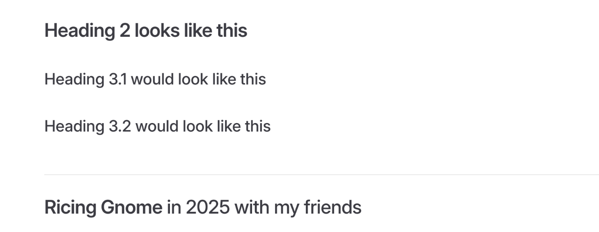

---
tags:
  - Contributions
title: Contribution Guidelines
createTime: 2025/06/09 11:25:08
permalink: /contributions/guidelines/
---

:::info This is a guideline for editing, styling, and formatting when editing Tuxie's Wiki. Please read and comply with these guidelines as it could jeopardize your opportunity in being a contributor.
:::

## **Formatting**

### **File naming convention**

We'll be using kebab-case to name files within the working directory.

:::note Examples

- kebab-case-is-the-best.txt
- tuxies-wiki.svg
- we-bare-bears.png
- become-a-contributor.md

:::

### **Titles, file names, & permalinks**

Titles of articles should use title case.

:::note Examples

- Firefox Guide
- Linux Guide
- Become a Contributor

:::

The name of the file should be derived from the name of the article (if it is one) and be informative. The permalink should derive from the distinguishable directory of the file.

:::note Examples
Gnome Guide @ `/docs/notes/linux-guides/gnome.md`

--> **/linux-guides/gnome/**

Terminal Customization (Bash) @ `/docs/guides/terminal-customization-bash.md`

--> **/guides/terminal-customization-bash/**
:::

### **Code formatting**

We're not strict with our code formatting as long as the output of your code is clean (i.e. the generated content is pretty).

We'd appreciate it if you use the Prettier extension in VS Code or an equivalent to format your code, though.

:::important Use relative links over permalinks when refering to internal pages to make the development smoother, when possible.
:::

### **Icons**

We'll follow the following hierarchy for icons:

#### Core website components

`mdi` >> `ic` >> others

We prefer to keep navigational and core coponents clean, without colors.

#### Cards

`fluent-emoji` >> `fluent-emojis` >> `devicon` >> `logos` >> others

Cards would preferably be catchy and fun.

#### Tabs

`devicon` >> `logos` >> `mdi` >> `ic` >> others

Similar to core components, they should be clean and informative; some color would be nice, though.

::::::details How to add an icon...

Format: `::emoji:name =size /color::`

`size` refers to the px size

`/color` refers to the hex value

::::details See code...

```md
::mdi:linux =50 /#000000::

::mdi:fedora =32 /#3f7ac3::

::fluent-emoji:party-popper::
```

::::

::::demo-wrapper
::mdi:linux =50 /#000000::

::mdi:fedora =32 /#3f7ac3::

::fluent-emoji:party-popper::
::::
::::::

## **Document components**

### Callout container

If the content you will be putting in the `callout container` is relatively short, simply make it the title of the callout.

::::details See code...

```md
:::important This is an annoucement for everybody: I love Linux!
:::

:::tip Everybody loves some pro tips :\)
:::
```

::::

::::demo-wrapper

:::important This is an annoucement for everybody: I love Linux!
:::

:::tip Everybody loves some pro tips :\)
:::

::::

### Card & card grid

You can use `card` to serve as a decorative callout container. Use `card-grid` to indicate the author(s), maintainer(s), and contributor(s) of an article.

For what icons to use, refer to [icons section](guidelines.md#card).

:::::details See code...

```md
::::card-grid

:::card title="Demo card 1" icon="fluent-emoji-flat:card-index"
:::

:::card title="Demo card 2" icon="fluent-emoji-flat:card-index"
::::
```

:::::

:::::demo-wrapper

::::card-grid

:::card title="Demo card 1" icon="fluent-emoji-flat:card-index"
:::

:::card title="Demo card 2" icon="fluent-emoji-flat:card-index"
::::

:::::

### Code

Use `code` to indicate files, programs, and directories. Simply surround the text you want to "codify" with backticks (`).

:::details See code...

```md
`fzf` is a program that allows for fuzzy searching in the cli.
```

:::

:::demo-wrapper
`fzf` is a program that allows for fuzzy searching in the cli.
:::

### Code block & inline code

==Always== wrap programs, applications, and directories in `inline code` (`) for better legibility.

::::details See code...

```md
Go to `~/Documents`

`Gnome Extension Manager` allows you to manage Gnome extensions.

`fastfetch` is pretty cool!
```

::::

:::demo-wrapper
Go to `~/Documents`

`Gnome Extension Manager` allows you to manage Gnome extensions.

`fastfetch` is pretty cool!
:::

==Always== wrap code around `code block` (```) for better legibility and styling consistency.

::::details See code...

````
```bash
# this is some example bash code
sudo dnf update
```
````

::::

:::demo-wrapper

```bash
# this is some example bash code
sudo dnf update
```

:::

### Code tabs

Use `code tabs` to:

- Indicate changes are made in a **specific file** (indicated by the file name). Check [Plume Theme Documentations](https://theme-plume.vuejs.press/guide/code/features/#%E4%BB%A3%E7%A0%81%E5%9D%97%E4%B8%AD%E7%9A%84%E9%A2%9C%E8%89%B2%E5%B7%AE%E5%BC%82) for details on code highlighting.
- To not use unnecessary space when displaying multiple files.

:::::details See code...

````MD
::::code-tabs

@tab Hello.java

```java
public class Hello {

  public static void main(string[] args) {

    Public.out.println("Hello world");
  }
}
```

@tab example.md

```md
---
author: aier
permalink: /testing/aier/
---

# Title text

Content text... Content text... Content text...

Content text...
```

::::
````

:::::

:::::demo-wrapper

::::code-tabs

@tab Hello.java

```java
public class Hello {

// [!code ++]
  public static void main(string[] args) {
// [!code ++]

// [!code ++]
    Public.out.println("Hello world");
// [!code ++]
  }
}
```

@tab example.md

```md
---
author: aier
permalink: /testing/aier/
---

# Title text

Content text... Content text... Content text...

Content text...
```

::::

:::::

### Demo wrapper

Use `demo wrapper` to show the product of something.

::::details See code...

```md
:::demo-wrapper
Content text...
:::
```

::::

:::demo-wrapper
Content text...
:::

::::details See code...

```md
:::demo-wrapper img

:::
```

:::::

:::demo-wrapper img

:::

### Details & collapse

Use `details` to collapse content that you don't want taking up a large amount of screen space.

::::details See code...

```md
:::details

The following is a picture of Ice Bear from We Bare Bears.


:::
```

::::

::::demo-wrapper

:::details

The following is a picture of Ice Bear from We Bare Bears.


:::

::::

When you have to use multiple `details` containers, use `collapse` instead.

<!-- :::important Do not use `inline code` and `highlight` formatting in the titles of collapse modules as they are visually buggy.

::: -->

Always pair `collapse` with a card unless the only content is a photo. If it has any text pair it with a card as such:

:::::details See code...

```md
::::collapse accordion

- Use a card for mixed media and sole text.

  :::card

  The following is a picture of Ice Bear from We Bare Bears.

  

  :::

- Card can be omitted in the case of a singular image.

  

::::
```

:::::

:::::demo-wrapper

::::collapse accordion

- Use a card for mixed media and sole text.

  :::card

  The following is a picture of Ice Bear from We Bare Bears.

  

  :::

- Card can be omitted in the case of a singular image.

  

::::

:::::

### Headings

- Heading 1 (#) does not appear in the table of contents, only use it in rare cases where Heading 2 (##) does not fit usecase.

- Keep the keywords of Heading 2 (##) and 3 (###) bold. If the heading is relatively short, make the entire heading bold for better distinction from regular text and Heading 4 (####)

- Heading 4 (####) does not appear on the table of contents, use it for minor titles/sections within larger topics

- We prefer not using titlecase in headings.

:::details See example...

```md
## **Heading 2**

### **Heading 3.1 would look like this**

### **Heading 3.2 would look like this**

## **Ricing Gnome** in 2025 with my friends

### **Heading 3.1 would look like this** if it was super duper long and has a lot of text

### **Heading 3.2 would look like this** if it was super duper long and has a lot of text
```

:::

:::demo-wrapper img


:::

### Highlighting

Use highlighting (==) to emphasize text, especially in paragraphs.

Do not use highlighting in titles such as haedings, step module titles, or collapse module titles.

:::details See code...
Linux is known for being ==flexible, secure, and stable==. It is ==open-source==, meaning its source code is freely available for anyone to view, modify, and distribute. This fosters a ==collaborative global community== that continuously improves the system.
:::

:::demo-wrapper
Linux is known for being ==flexible, secure, and stable==. It is ==open-source==, meaning its source code is freely available for anyone to view, modify, and distribute. This fosters a ==collaborative global community== that continuously improves the system.
:::

### Steps

Use "-" to auto-generate `steps` instead of manually numbering them. It helps maintenance and editing much easier.

Keep the keywords of your step titles bold. If the step title is relatively short, make the entire title bold for better distinction from content text.

:::::details See code...

```md
:::steps

- **This is a step**

  Content...

- **This is another step**

  This is even more content...

- **This is yet another step** but it is longer and you probably only want to make keywords bold

  This is yet even more content...

:::
```

:::::

::::demo-wrapper

:::steps

- **This is a step**

  Content...

- **This is another step**

  This is even more content...

- **This is yet another step** but it is longer and you probably only want to make keywords bold

  This is yet even more content...

:::

::::

### Tabs

Use `tabs` for showing multiple options to not use up unnecessary space.

:::::details See code...

````md
:::tabs

@tab ::devicon:debian:: Debian/Ubuntu

```bash
sudo apt install timeshift
```

@tab ::devicon:fedora:: Fedora

```bash
sudo dnf install timeshift
```

@tab ::devicon:archlinux:: Arch

```bash
pacman -S timeshift
```

:::
````

:::::

:::::demo-wrapper

:::tabs

@tab ::devicon:debian:: Debian/Ubuntu

```bash
sudo apt install timeshift
```

@tab ::devicon:fedora:: Fedora

```bash
sudo dnf install timeshift
```

@tab ::devicon:archlinux:: Arch

```bash
pacman -S timeshift
```

:::

:::::

### Code Tree

Use `code tree` for specifying file structures and/or to specify the content of many files under the same directory.

:::::details See code...

````md
::::code-tree title="Some Python Project" height="400px" entry="src/main.py"

```python title="src/visualization/some-files.py"
e = mc^2

# Some more python code...
```

```python title="src/algorithms/algorithms.py"
Some impressive algorithm
```

```python title="src/main.py"
Some python code
```

```json title="dataset.json"
{
  "data1": "Hello world",
  "data2": {
    "data3": "My name is Lunear"
  }
}
```

::::
````

:::::

::::code-tree title="Some Python Project" height="400px" entry="src/main.py"

```python title="src/visualization/some-files.py"
e = mc^2

# Some more python code...
```

```python title="src/algorithms/algorithms.py"
Some impressive algorithm
```

```python title="src/main.py"
Some python code
```

```json title="dataset.json"
{
  "data1": "Hello world",
  "data2": {
    "data3": "My name is Lunear"
  }
}
```

::::
