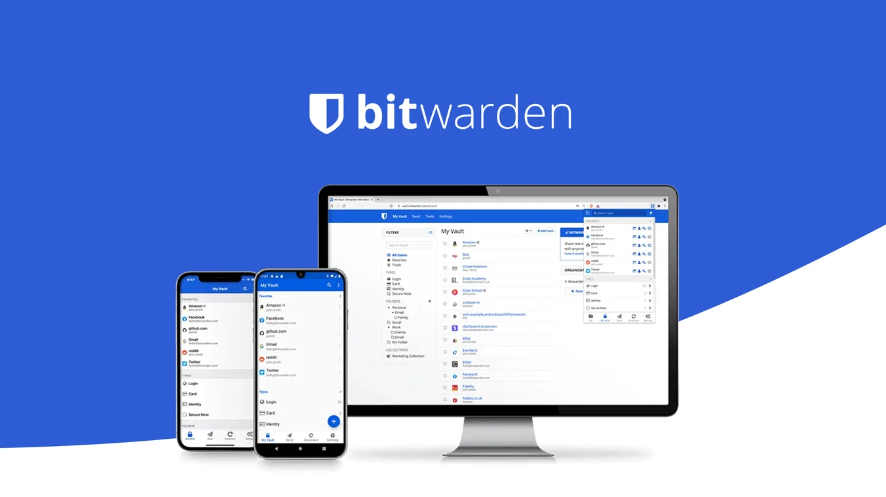
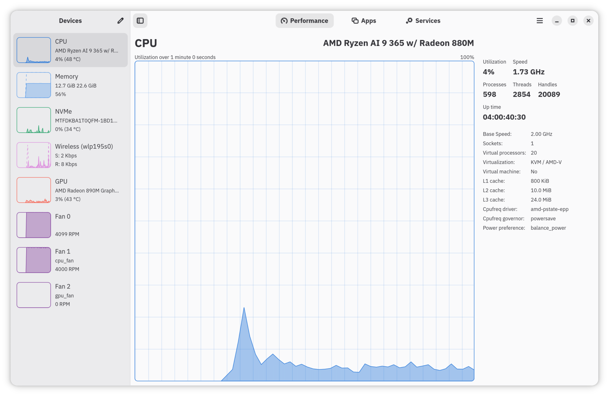
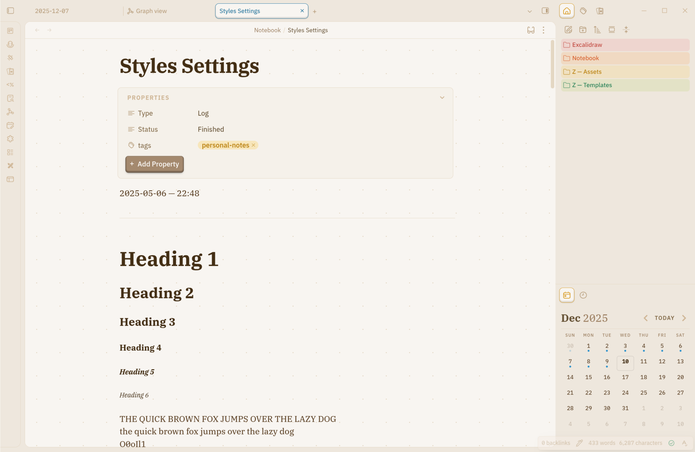

## **[LocalSend](https://localsend.org/)**

:::details Open-source, cross-platform file sharer to nearby devices.

:::

:::tabs

@tab ::simple-icons:flatpak:: Flatpak (System)

```bash
flatpak install flathub org.localsend.localsend_app
```

@tab ::simple-icons:flatpak:: Flatpak (User)

```bash
flatpak install --user flathub org.localsend.localsend_app
```

@tab ::devicon:archlinux:: Arch (AUR)

```bash
yay -S localsend-bin
```

:::

## **[Inkscape](https://flathub.org/apps/org.inkscape.Inkscape)**

Open-source vector graphic editor

:::tabs

@tab ::simple-icons:flatpak:: Flatpak (System)

```bash
flatpak install flathub org.inkscape.Inkscape
```

@tab ::simple-icons:flatpak:: Flatpak (User)

```bash
flatpak install --user org.inkscape.Inkscape
```
## **[Zen Browser](https://flathub.org/apps/app.zen_browser.zen)**

:::details A feature-rich, Firefox based browser that just works with smooth animations and QoL features.

:::

:::tabs
@tab ::simple-icons:flatpak:: Flatpak (System)

```bash
flatpak install flathub app.zen_browser.zen
```

@tab ::simple-icons:flatpak:: Flatpak (User)

```bash
flatpak install --user flathub app.zen_browser.zen
```

@tab ::devicon:archlinux:: Arch (AUR)

```bash
yay -S zen-browser-bin
```

:::

## **[Bitwarden](https://bitwarden.com/)**

Useful and intuitive system resources displayer, that accurately displays information including CPU, GPU, RAM, processes, among others.
:::details Safe, trusted password manager.

:::

:::tabs

@tab ::simple-icons:flatpak:: Flatpak (System)

```bash
flatpak install flathub com.bitwarden.desktop
```

@tab ::simple-icons:flatpak:: Flatpak (User)

```bash
flatpak install --user flathub com.bitwarden.desktop
```

:::

Bitwarden is also offered as a browser extension:
[Firefox](https://addons.mozilla.org/en-US/firefox/addon/bitwarden-password-manager/?browser=firefox)
[Chrome](https://addons.mozilla.org/en-US/firefox/addon/bitwarden-password-manager/?browser=firefox)
[Edge](https://microsoftedge.microsoft.com/addons/detail/bitwarden-password-manage/jbkfoedolllekgbhcbcoahefnbanhhlh)
[Opera](https://microsoftedge.microsoft.com/addons/detail/bitwarden-password-manage/jbkfoedolllekgbhcbcoahefnbanhhlh)
[Brave](https://chromewebstore.google.com/detail/bitwarden-password-manage/nngceckbapebfimnlniiiahkandclblb?browser=brave)

## **[Mission Center](https://flathub.org/apps/io.missioncenter.MissionCenter)**

:::details Useful and intuitive system resources monitor that accurately displays informations including CPU, GPU, RAM, processes, among others.

:::

:::tabs

@tab ::simple-icons:flatpak:: Flatpak (System)

```bash
flatpak install flathub io.missioncenter.MissionCenter
```

@tab ::simple-icons:flatpak:: Flatpak (User)

```bash
flatpak install --user flathub io.missioncenter.MissionCenter
```

:::

## **[Obsidian](https://flathub.org/apps/md.obsidian.Obsidian)**

::: details Obsidian is a powerful markdown note-taking app available across different platforms. Obsidian supports custom theming, sync (paid), and publishing services. Write everything that is useful or that can be useful down and start building your second brain!

:::

:::tabs

@tab ::simple-icons:flatpak:: Flatpak (System)

```bash
flatpak install flathub md.obsidian.Obsidian
```

@tab ::simple-icons:flatpak:: Flatpak (User)

```bash
flatpak install --user flathub md.obsidian.Obsidian
```

:::

## **[Scrcpy](https://github.com/Genymobile/scrcpy)**

**From Scrcpy's GitHub:** "This application mirrors Android devices (video and audio) connected via USB or TCP/IP and allows control using the computer's keyboard and mouse. It does not require root access or an app installed on the device. It works on Linux, Windows, and macOS."

:::tabs

@tab ::devicon:fedora:: Fedora

```bash
sudo dnf copr enable zeno/scrcpy && sudo dnf install scrcpy
```

@tab ::devicon:archlinux:: Arch

```bash
pacman -S scrcpy
```

@tab ::devicon:debian:: Debian/Ubuntu

Install the .tar.gz file from the link above

:::

## **[Vesktop](https://flathub.org/apps/dev.vencord.Vesktop)**

Discord with screen sharing and audio support, as well as Vencord inbuilt.

**If you do not care about Discord Rich Presence (DRP), proceed with the Flatpak installation.**

**If you do want DRP, check out [Vesktop’s Github Releases](https://github.com/Vencord/Vesktop/releases) and download the package for your respective distribution.**

:::tabs
@tab ::simple-icons:flatpak:: Flatpak (System)

```bash
flatpak install flathub dev.vencord.Vesktop
```

@tab ::simple-icons:flatpak:: Flatpak (User)

```bash
flatpak install --user flathub dev.vencord.Vesktop
```

:::

## **[Waydroid](https://docs.waydro.id/usage/install-on-desktops)**

Run Android on Linux!

Find out about installation details on the link above
:::tabs

@tab ::devicon:fedora:: Fedora

```bash
sudo dnf install waydroid
```

@tab ::devicon:archlinux:: Arch (AUR)

```bash
sudo yay -S waydroid
```

@tab ::devicon:debian:: Debian/Ubuntu

```bash
sudo apt install curl ca-certificates -y
curl https://repo.waydro.id | sudo bash
sudo apt install waydroid -y
```

:::

## **[Gradia](https://flathub.org/en/apps/be.alexandervanhee.gradia)**

:::details Screenshot application with annotation modes including text, arrow, and censor

:::

:::tabs

@tab ::simple-icons:flatpak:: Flatpak (System)

```bash
flatpak install flathub be.alexandervanhee.gradia
```

@tab ::simple-icons:flatpak:: Flatpak (User)

```bash
flatpak install --user flathub be.alexandervanhee.gradia
```

:::
