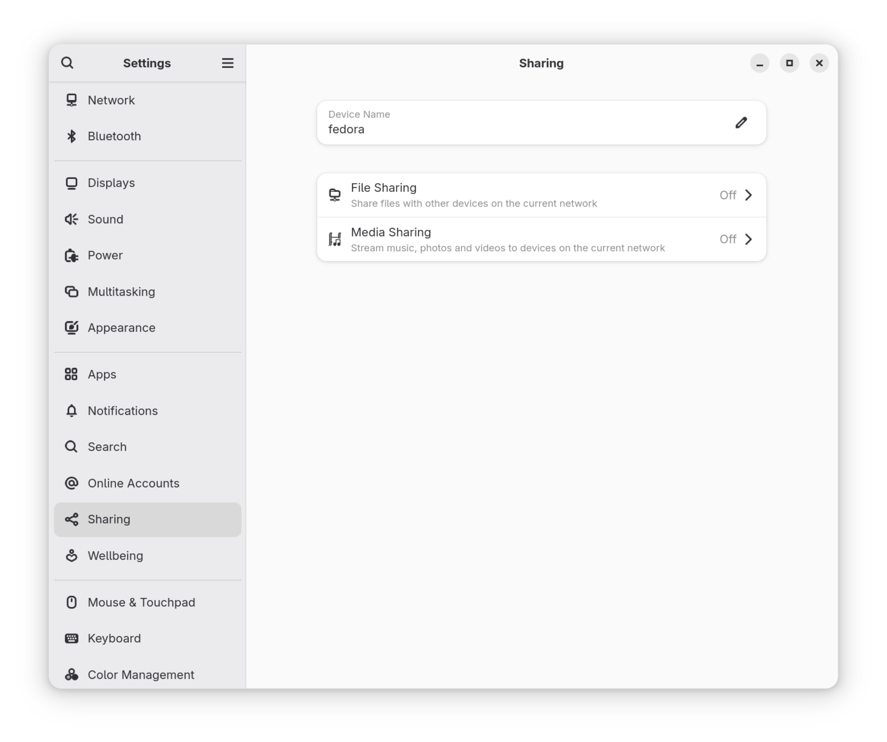

:::caution
**THIS GUIDE IS CURRENTLY STILL UNDER CONSTRUCTION**
:::

Fedora is the prefered distro of **aier**. Fedora offers a high-quality out-of-the-box experience

## Let's get started

### Installation

::::steps

1. Install Fedora onto your machine

   :::warning Under construction
   TODO:

   - [ ] Fedora installation video.

   :::

2. Update system

   :::tabs
   @tab Terminal

   ```bash
   sudo dnf update -y
   ```

   @tab GUI (Gnome Software)
   
   :::

3. Reboot

   ```bash
   reboot
   ```

::::

### Create snapshots for your computer (highly recommended unless space is limited)

We'll be using **Timeshift**, but you can use whichever snapshot/backup tool you like.

### Go through the settings app

Go through the settings app and make some quick tweaks to your needs.



## Further adjusting the workflow

### Install some apps for more advanced options

:::important
This is only for Gnome users.
:::

:::tip
You can always use your distro's GUI software store (such as Gnome's **Software** instead of the commandline).
:::

You'd need [Gnome Tweaks](../linux-apps/gnomie.md#gnome-tweaks), [Dconf Editor](../linux-apps/gnomie.md#dconf-editor), and [Extension Manager](../linux-apps/gnomie.md#extension-manager).

```bash
sudo dnf install gnome-tweaks
sudo dnf install dconf-editor
```

:::tabs

@tab Flatpak (System)

```bash
flatpak install flathub com.mattjakeman.ExtensionManager
```

@tab Flatpak (User)

```bash
flatpak install --user flathub com.mattjakeman.ExtensionManager
```

:::

## Further customization

4. Adw-gtk3
5. Ocean theme
